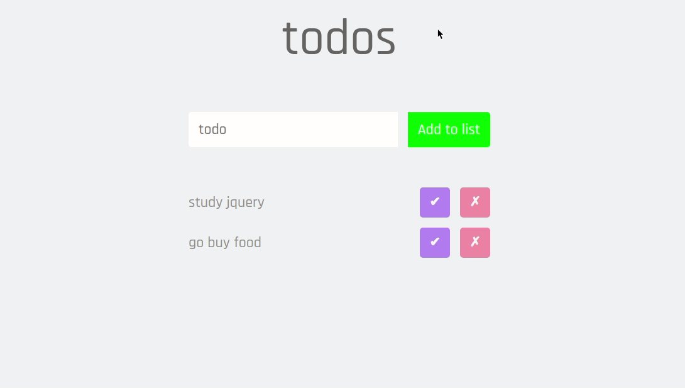

<p align="center">
  <h3 align="center">Todo web app with ReactJS</h3>

  <p align="center">
    A todo list made with ReactJS and Styled Components.
    <br />
    <a href="https://github.com/lucfersan/todo-list-react"><strong>Explore the docs »</strong></a>
    <br />
    <br />
    ·
    <a href="https://github.com/lucfersan/todo-list-react/issues">Report Bug</a>
    ·
    <a href="https://github.com/lucfersan/todo-list-react/issues">Request Feature</a>
  </p>
</p>

## About The Project



This is a todo app with react, which has some great functionalities such as authentication, connection to an external api, and more!

**This is the [Api-Repo](https://github.com/lucfersan/api-todo-list-react) I developed for this project.**

It uses react context api to handle some features such as the update modal and authentication credentials.

It was a great experience for me to work with those technologies and learn a little bit of deployment and connection to an external service.

### Built With

- [React](https://reactjs.org/)
- [Styled Components](https://styled-components.com/)
- [Typescript](https://www.typescriptlang.org/)
- [Context API](https://reactjs.org/docs/context.html)

### Installation

1. Clone the repo
   ```sh
   git clone https://github.com/lucfersan/todo-list-react.git
   ```
2. Install the packages
   ```sh
   cd todo-list-react
   yarn
   ```

## Contributing

Contributions are what make the open source community such an amazing place to be learn, inspire, and create. Any contributions you make are **greatly appreciated**.

1. Fork the Project
2. Create your Feature Branch (`git checkout -b feature/AmazingFeature`)
3. Commit your Changes (`git commit -m 'Add some AmazingFeature'`)
4. Push to the Branch (`git push origin feature/AmazingFeature`)
5. Open a Pull Request

## License

Distributed under the MIT License. See `LICENSE` for more information.

## Contact

Lucas Fernandes - fernandes.lucas11@outlook.com
