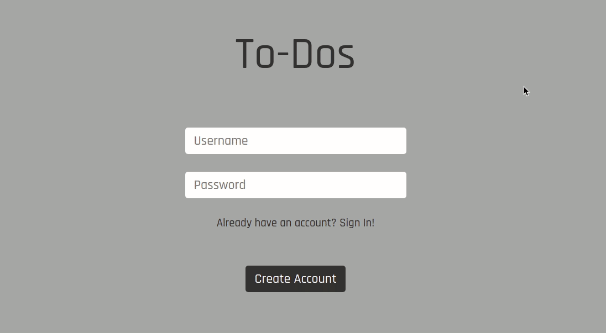

<p align="center">
  <h3 align="center">Todo web app with ReactJS</h3>

  <p align="center">
    A simple todo list made with ReactJS and Styled Components.
    <br />
    <a href="https://github.com/lucfersan/todo-list-react"><strong>Explore the docs »</strong></a>
    <br />
    <br />
    ·
    <a href="https://github.com/lucfersan/todo-list-react/issues">Report Bug</a>
    ·
    <a href="https://github.com/lucfersan/todo-list-react/issues">Request Feature</a>
  </p>
</p>

## About The Project



This is a simple todo app with react, just for the sake of practicing a little bit react hooks.

It uses the react context api to control the modal.

PS: This project has two branches, the master, which is hosted on the web, and you can access it in the project link at the end of this README, and the api one. In order to use the second one you need to clone this [REPO](https://github.com/lucfersan/api-todos-list-react), which is the api I developed for this project, and follow the steps to use it.

### Built With

- [React](https://reactjs.org/)
- [Styled Components](https://styled-components.com/)
- [Typescript](https://www.typescriptlang.org/)
- [Context API](https://reactjs.org/docs/context.html)

### Installation

1. Clone the repo
   ```sh
   git clone https://github.com/lucfersan/todo-list-react.git
   ```
2. Install the packages
   ```sh
   cd todo-list-react
   yarn
   ```

## Contributing

Contributions are what make the open source community such an amazing place to be learn, inspire, and create. Any contributions you make are **greatly appreciated**.

1. Fork the Project
2. Create your Feature Branch (`git checkout -b feature/AmazingFeature`)
3. Commit your Changes (`git commit -m 'Add some AmazingFeature'`)
4. Push to the Branch (`git push origin feature/AmazingFeature`)
5. Open a Pull Request

## License

Distributed under the MIT License. See `LICENSE` for more information.

## Contact

Lucas Fernandes - fernandes.lucas11@outlook.com

Project Link - live view: [https://listlucas.netlify.app/](https://listlucas.netlify.app/)
